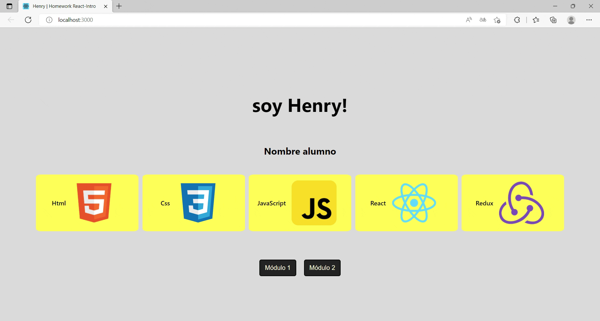

# HW 07 - React-Estilos | Ejercicios

## Duración estimada 🕒

60 minutos

---

## Consigna de la homework

En esta homework, aprenderás a utilizar las diferentes formas de aplicar estilos en React 🎨

-  Aplicarás al componente **Bienvenido.jsx** `module.css` e `inline styling`.
-  Aplicarás al componente **Botones.jsx** `styled components`.

---

### Pasos básicos para realizar la homework

🔹 Para poder ejecutar los `test` de esta homework, es necesario que abras la terminal ubicados dentro de la carpeta `01 - Exercises`.

-  Cuando te encuentres en esta carpeta, debes ejecutar el comando:

* Listo!! Ya puedes correr los test con el comando `npm test` (o `npm t`). Los dos primeros pasarán sin que hagas nada, simplemente están para que te ayuden a verificar que estás realizando correctamente los pasos y que no tienes errores.

<<<<<<< HEAD
◻️ Para poder correr la aplicación de forma local, sólo debes ejecutar el comando `npm start`.
=======
-  Listo!! Ya puedes correr los test:
>>>>>>> 7060f3d5b9b3920f216bd1745e8d9e5d6c986382

* Ingresando a <http://localhost:3000> desde el navegador, podremos ir viendo en tiempo real el resultado de nuestro trabajo.


---

🔹 Para poder correr la aplicación de forma local, debes abrir una segunda terminal, ubicarte en la carpeta que estás trabajando y ejecuta el comando:

Dentro de la carpeta `01 - Exercise`, vas a encontrar la siguiente estructura:

-  Ingresando a <http://localhost:3000> desde el navegador, podrás ir viendo en tiempo real el resultado de su trabajo.

🔹 Una carpeta llamada `public`

🔹 Una carpeta llamada `src` (Es la carpeta en donde trabajaremos)

🔹 Una carpeta llamada `tests`

🔹 Un archivo package.json

-  Una carpeta llamada **_mocks_**
-  Una carpeta llamada **public**
-  Una carpeta llamada `src` (Es la carpeta en donde trabajarás)
-  Una carpeta llamada **tests**
-  Un archivo **package.json**
-  Y el archivo `README.md` que ahora mismo estás leyendo. 🧐

---

## 👩‍💻 Ejercicio

🔹 Dentro de la carpeta `src` encontrarás el esqueleto del proyecto React, estructurado de la siguiente manera:

<<<<<<< HEAD
* Una carpeta llamada assets

* Una carpeta llamada components

* Un archivo llamado App.js

* Un archivo index.js

* Un archivo index.css (estilos)

🔹 Para estos ejercicios, trabajarás sólo dentro la carpeta `components`. Dentro de esta carpeta encontrarás:

* Una carpeta llamada Bienvenido, la cual a su vez contiene:
=======
-  Una carpeta llamada **assets**
-  Una carpeta llamada `components`
-  Un archivo llamado **App.js**
-  Un archivo **index.css**
-  Un archivo **index.js**

🔹 Para estos ejercicios, trabajarás sólo dentro la carpeta `components`. Dentro de esta carpeta encontrarás:

-  Una carpeta llamada **Bienvenido**, la cual a su vez contiene:
   -  El componente `Bienvenido.jsx`
   -  La hoja de estilos `Bienvenido.module.css`
-  Una carpeta llamada **Botones**, la cual a su vez contiene:
   -  El componente `Botones.jsx`
>>>>>>> 7060f3d5b9b3920f216bd1745e8d9e5d6c986382

    * El componente Bienvenido.jsx

    * La hoja de estilos Bienvenido.module.css

* Una carpeta llamada Botones, la cual a su vez contiene:

    * El componente Botones.jsx

**1. Comencemos con la carpeta Bienvenido:**

◻️ Abre el archivo Bienvenido.module.css, dentro de él encontrarás las clases con sus estilos.

-  El import de la librería **React**, el componente **Botones**, los archivos en formato de imagen y el archivo `Bienvenido.module.css` **(que debes descomentar para poder empezar a trabajar)**

-  Las constantes `studentName`, `techSkills` y `alerts` que viste en la homework anterior.

-  La función Bienvenido que renderiza:

1. Un div.
2. Dentro de este div, se renderiza:
   -  Una etiqueta h1
   -  Una etiqueta h3 que renderiza el nombre del alumno
   -  Una etiqueta ul (lista desordenada)
      -  Dentro de la ul se renderizan varias etiquetas li (ítems de lista) correspondientes al array de `techSkills`
   -  El componente `Botones`

        a. Un h1

        b. Un h3

<<<<<<< HEAD
        c. Una ul (lista desordenada)
=======
```html
<div className="{styles.classExample}">Example</div>
```
>>>>>>> 7060f3d5b9b3920f216bd1745e8d9e5d6c986382

        -  dentro de la ul se renderiza una li (lista) con el array de techSkills.

        d. El componente Botones.
        
🔹 Debes aplicar la clase que corresponda al elemento HTML usando el atributo className. 

### Continúa con la carpeta Botones

Ya sabes cómo funciona y se conectan los archivos module.css a los componentes, ahora estila desde cero en el componente Botones, pero esta vez será aplicando `Styled Components`, para ello debes seguir los siguientes pasos:

1. En el componente `Botones.jsx`, importa `styled` desde "styled-components"`
2. Encontrarás una constante llamada `DivButtons`, la cual debe contener mínimamente los siguientes estilos para el div:
   -  `display: flex;`
   -  `flex-direction: row;`
   -  `justify-content: space-around;`
   -  `align-items: center;`

<<<<<<< HEAD

1. En el componente `Botones.jsx`, importa `styled desde `"styled-components"`

2. Encontrarás una constante llamada 'DivButtons', la cual debe contener mínimamente los estilos `'display: flex'` y `'flex-direction: row'` para el div. Por ejemplo:
=======
Por ejemplo:
>>>>>>> 7060f3d5b9b3920f216bd1745e8d9e5d6c986382

```jsx

const DivExample = styled.div`
<<<<<<< HEAD
    width: 100vw; 
    height: 100 hw`;

```

3. Encontrarás una constante llamada 'Buttons', la cual debe contener mínimamente los estilos `'border-radius: 5px'` y `'color: beige'` para los botones.
=======
   width: 100vw;
   height: 100 hw;
`;
```

3. Encontrarás una constante llamada `Buttons`, la cual debe contener mínimamente los estilos para los botones:

   -  `border-radius: 5px;`
   -  `margin: 10px;`
   -  `padding: 5px;`
>>>>>>> 7060f3d5b9b3920f216bd1745e8d9e5d6c986382

4. Cambia las etiquetas por las constantes mencionadas anteriormente. Por ejemplo: 

<<<<<<< HEAD
```jsx
<div></div> 
=======
```html
<div></div>
>>>>>>> 7060f3d5b9b3920f216bd1745e8d9e5d6c986382

//cambiaría por:

<DivExample></DivExample>
```

> **Nota**: Para los estilos puedes guiarte del ejercicio anterior. 💡

---

**...Estamos llegando a la última parte de la homework** ⭐

## 👩‍💻 Ejercicio Extra

🔹 Volviendo al componente Bienvenido, aplica estilo a la etiqueta h1, utilizando `inline styling`. Intenta cambiarle su color a rojo, "pisando" el estilo que se aplica por CSS Modules.

* El componente debe verse en el navegador similar a esta imagen:

<p align="center"></p>

---

## Recordemos que...

🔹 Puedes utilizar cualquiera de los métodos enseñados en clase y practicados en este ejercicio para aplicar estilos en React.

🔹 Si vas a utilizar styled componentes, las variables const deben ser con mayúscula inicial.

<<<<<<< HEAD
🔹 Para utilizar estilos en línea o inline styling, debes usar el atributo 'style', estableciendo su valor como un objeto de javascript.

🔹 Si utilizas module.css el alcance de tu css será local y evitarás conflictos como pisar estilos en tu proyecto.

🔹 Aplicar estilos es como pintar un cuadro, no hay límites en la imaginación y creatividad, sin olvidarnos de dar a los usuarios la mejor experiencia. 😃
=======
-  Puedes utilizar cualquiera de los métodos enseñados en clase y practicados en este ejercicio para aplicar estilos en React.
-  Si vas a utilizar `styled components`, el nombre de las variables `const` deben comenzar con mayúscula.
-  Para utilizar estilos en línea o `inline styling`, debes usar el atributo `style`, estableciendo su valor **como un objeto de javascript**.
-  Si utilizas `CSS Modules`, el alcance de tus estilos será local para cada componente y evitarás conflictos como pisar estilos en tu proyecto. Es necesario que la extensión de los archivos donde se definan los estilos sea `.module.css`.
-  Aplicar estilos es como pintar un cuadro, no hay límites en la imaginación y creatividad, sin olvidarnos de dar a los usuarios la mejor experiencia. 😃
>>>>>>> 7060f3d5b9b3920f216bd1745e8d9e5d6c986382

---

## Recursos adicionales

<<<<<<< HEAD
Documentación **"Styled Components"** <https://styled-components.com/docs/basics>

Documentación **"CSS"** <https://www.w3schools.com/css/default.asp>
=======
-  Documentación **"Styled Components"** <https://styled-components.com/docs/basics>
-  Documentación **"CSS"** <https://www.w3schools.com/css/default.asp>
>>>>>>> 7060f3d5b9b3920f216bd1745e8d9e5d6c986382

---

Listo!! Ahora estás preparado para estilar tu app!! 👨‍🎨👩‍🎨✨🚀

Dirígete a la carpeta 📂 [**"02 - Integration"**](../02%20-%20Integration/README.md) y diviértete estilando la app de Rick & Morty 🤩
